tidyHeatmap
================

<!-- badges: start -->

[](https://lifecycle.r-lib.org/articles/stages.html)
[](https://doi.org/10.21105/joss.02472)
<!-- badges: end -->

## Citation

Mangiola et al., (2020). tidyHeatmap: an R package for modular heatmap
production based on tidy principles. Journal of Open Source Software,
5(52), 2472, <https://doi.org/10.21105/joss.02472>

Please have a look also to

-   [tidygate](https://github.com/stemangiola/tidygate/) for adding
    custom gate information to your tibble
-   [tidySingleCellExperiment](https://stemangiola.github.io/tidySingleCellExperiment/)
    for tidy manipulation of Seurat objects
-   [tidyseurat](https://stemangiola.github.io/tidyseurat/) for tidy
    manipulation of Seurat objects
-   [tidybulk](https://stemangiola.github.io/tidybulk/) for tidy
    high-level data analysis and manipulation
-   [tidySummarizedExperiment](https://stemangiola.github.io/tidySummarizedExperiment/)
    for heatmaps produced with tidy principles

website:
[stemangiola.github.io/tidyHeatmap](https://stemangiola.github.io/tidyHeatmap/)

`tidyHeatmap` is a package that introduces tidy principles to the
creation of information-rich heatmaps. This package uses
[ComplexHeatmap](https://bioconductor.org/packages/release/bioc/html/ComplexHeatmap.html)
as graphical engine.

**Advantages:**

-   Modular annotation with just specifying column names
-   Custom grouping of rows is easy to specify providing a grouped tbl.
    For example `df |> group_by(...)`
-   Labels size adjusted by row and column total number
-   Default use of Brewer and Viridis palettes

## Functions/utilities available

| Function           | Description                                 |
|--------------------|---------------------------------------------|
| `heatmap`          | Plots base heatmap                          |
| `add_tile`         | Adds tile annotation to the heatmap         |
| `add_point`        | Adds point annotation to the heatmap        |
| `add_bar`          | Adds bar annotation to the heatmap          |
| `add_line`         | Adds line annotation to the heatmap         |
| `layer_point`      | Adds layer of symbols on top of the heatmap |
| `layer_square`     | Adds layer of symbols on top of the heatmap |
| `layer_diamond`    | Adds layer of symbols on top of the heatmap |
| `layer_arrow_up`   | Adds layer of symbols on top of the heatmap |
| `layer_arrow_down` | Add layer of symbols on top of the heatmap  |
| `split_rows`       | Splits the rows based on the dendogram      |
| `split_columns`    | Splits the columns based on the dendogram   |
| `save_pdf`         | Saves the PDF of the heatmap                |

## Installation

To install the most up-to-date version

``` r
devtools::install_github("stemangiola/tidyHeatmap")
```

To install the most stable version (however please keep in mind that
this package is under a maturing lifecycle stage)

``` r
install.packages("tidyHeatmap")
```

## Contribution

If you want to contribute to the software, report issues or problems
with the software or seek support please open an issue
[here](https://github.com/stemangiola/tidyHeatmap/issues)

## Input data frame

The heatmaps visualise a multi-element, multi-feature dataset, annotated
with independent variables. Each observation is a element-feature pair
(e.g., person-physical characteristics).

| element         | feature         | value     | independent_variables |
|-----------------|-----------------|-----------|-----------------------|
| `chr` or `fctr` | `chr` or `fctr` | `numeric` | …                     |

Let’s transform the mtcars dataset into a tidy
“element-feature-independent variables” data frame. Where the
independent variables in this case are ‘hp’ and ‘vs’.

``` r
mtcars_tidy <- 
    mtcars |> 
    as_tibble(rownames="Car name") |> 
    
    # Scale
    mutate_at(vars(-`Car name`, -hp, -vs), scale) |>
    
    # tidyfy
    pivot_longer(cols = -c(`Car name`, hp, vs), names_to = "Property", values_to = "Value")

mtcars_tidy
```

    ## # A tibble: 288 x 5
    ##    `Car name`       hp    vs Property Value[,1]
    ##    <chr>         <dbl> <dbl> <chr>        <dbl>
    ##  1 Mazda RX4       110     0 mpg          0.151
    ##  2 Mazda RX4       110     0 cyl         -0.105
    ##  3 Mazda RX4       110     0 disp        -0.571
    ##  4 Mazda RX4       110     0 drat         0.568
    ##  5 Mazda RX4       110     0 wt          -0.610
    ##  6 Mazda RX4       110     0 qsec        -0.777
    ##  7 Mazda RX4       110     0 am           1.19 
    ##  8 Mazda RX4       110     0 gear         0.424
    ##  9 Mazda RX4       110     0 carb         0.735
    ## 10 Mazda RX4 Wag   110     0 mpg          0.151
    ## # … with 278 more rows

## Plotting

For plotting, you simply pipe the input data frame into heatmap,
specifying:

-   The rows, cols relative column names (mandatory)
-   The value column name (mandatory)
-   The annotations column name(s)

mtcars

``` r
mtcars_heatmap <- 
    mtcars_tidy |> 
    heatmap(`Car name`, Property, Value ) |>
    add_tile(hp)
```

    ## tidyHeatmap says: (once per session) from release 1.2.3 the grouping labels have white background by default. To add color for one-ay grouping specify palette_grouping = list(c("red", "blue"))

``` r
mtcars_heatmap
```

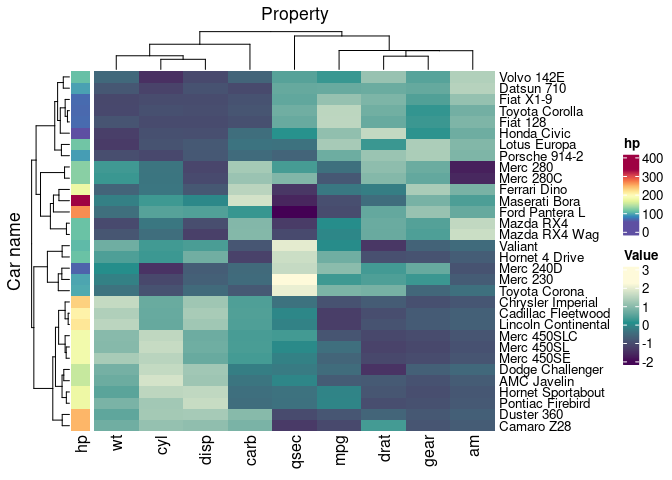<!-- -->

## Saving

``` r
mtcars_heatmap |> save_pdf("mtcars_heatmap.pdf")
```

## Grouping and splitting

We can easily group the data (one group per dimension maximum, at the
moment only the vertical dimension is supported) with dplyr, and the
heatmap will be grouped accordingly

``` r
# Make up more groupings
mtcars_tidy_groupings = 
    mtcars_tidy |>
    mutate(property_group = if_else(Property %in% c("cyl", "disp"), "Engine", "Other"))

mtcars_tidy_groupings |> 
    group_by(vs, property_group) |>
    heatmap(`Car name`, Property, Value ) |>
    add_tile(hp)
```

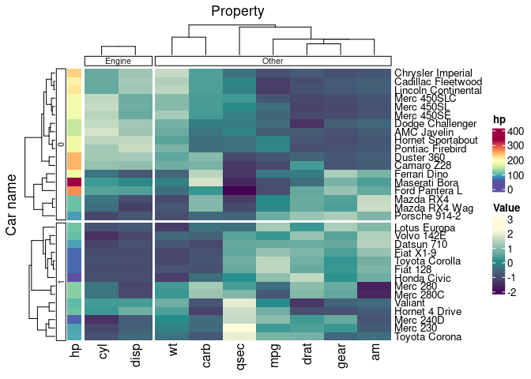<!-- -->

We can provide colour palettes to groupings

``` r
mtcars_tidy_groupings |> 
    group_by(vs, property_group) |>
    heatmap(
        `Car name`, Property, Value ,
        palette_grouping = list(
            
            # For first grouping (vs)
            c("#66C2A5", "#FC8D62"), 
            
            # For second grouping (property_group)
            c("#b58b4c", "#74a6aa")
        )
    ) |>
    add_tile(hp)
```

<!-- -->

We can split based on the cladogram

``` r
mtcars_tidy |> 
    heatmap(`Car name`, Property, Value ) |>
    split_rows(2) |>
    split_columns(2)
```

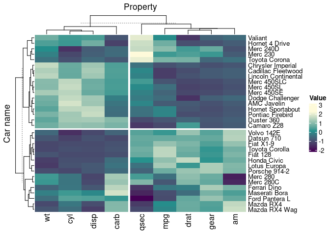<!-- -->

We can split on kmean clustering (using ComplexHeatmap options, it is
stochastic)

``` r
mtcars_tidy |> 
    heatmap(
        `Car name`, Property, Value ,
        row_km = 2,
        column_km = 2
    ) 
```

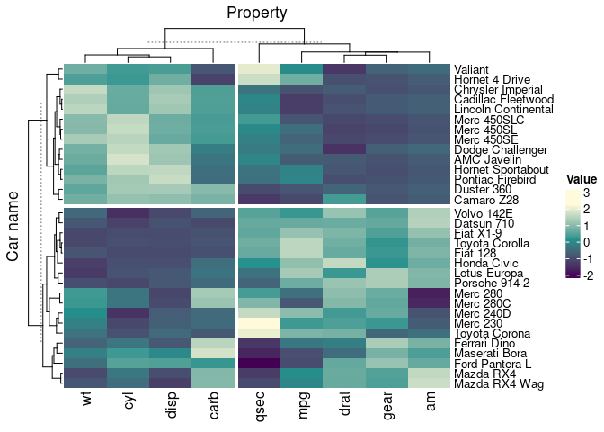<!-- -->

## Custom palettes

We can easily use custom palette, using strings, hexadecimal color
character vector,

``` r
mtcars_tidy |> 
    heatmap(
        `Car name`, 
        Property, 
        Value,
        palette_value = c("red", "white", "blue")
    )
```

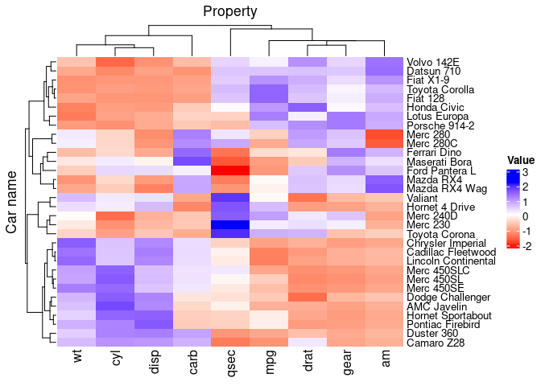<!-- -->

A better-looking blue-to-red palette

``` r
mtcars_tidy |> 
    heatmap(
        `Car name`, 
        Property, 
        Value,
        palette_value = circlize::colorRamp2(
            seq(-2, 2, length.out = 11), 
            RColorBrewer::brewer.pal(11, "RdBu")
        )
    )
```

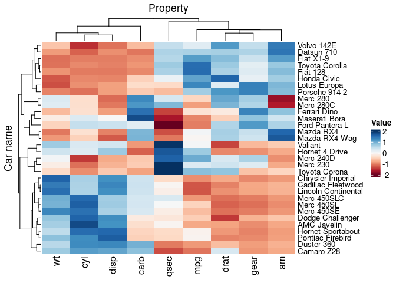<!-- -->

Or a grid::colorRamp2 function for higher flexibility

``` r
mtcars_tidy |> 
    heatmap(
        `Car name`, 
        Property, 
        Value,
        palette_value = circlize::colorRamp2(c(-2, -1, 0, 1, 2), viridis::magma(5))
    )
```

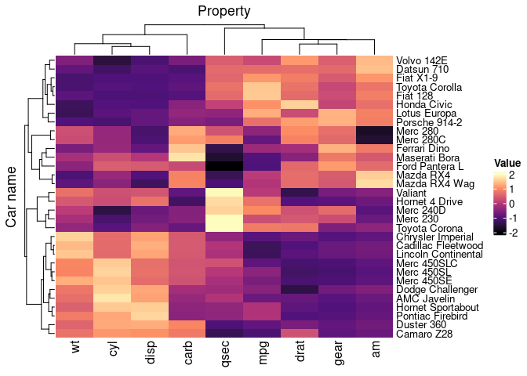<!-- -->

## Multiple groupings and annotations

``` r
tidyHeatmap::pasilla |>
    group_by(location, type) |>
    heatmap(
        .column = sample,
        .row = symbol,
        .value = `count normalised adjusted`
    ) |>
    add_tile(condition) |>
    add_tile(activation)
```

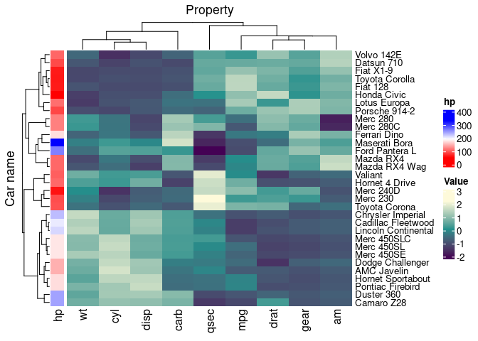<!-- -->

Remove legends, adding aesthetics to annotations in a modular fashion,
using `ComplexHeatmap` arguments

``` r
tidyHeatmap::pasilla |>
    group_by(location, type) |>
    heatmap(
        .column = sample,
        .row = symbol,
        .value = `count normalised adjusted`,
        show_heatmap_legend = FALSE
    ) |>
    add_tile(condition, show_legend = FALSE) |>
    add_tile(activation, show_legend = FALSE)
```

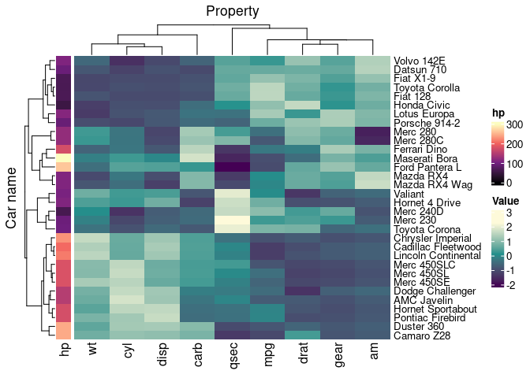<!-- -->

## Annotation types

“tile”, “point”, “bar” and “line” are available

``` r
# Create some more data points
pasilla_plus <- 
    tidyHeatmap::pasilla |>
    dplyr::mutate(act = activation) |> 
    tidyr::nest(data = -sample) |>
    dplyr::mutate(size = rnorm(n(), 4,0.5)) |>
    dplyr::mutate(age = runif(n(), 50, 200)) |>
    tidyr::unnest(data) 

# Plot
pasilla_plus |>
    heatmap(
        .column = sample,
        .row = symbol,
        .value = `count normalised adjusted`
    ) |>
    add_tile(condition) |>
    add_point(activation) |>
    add_tile(act) |>
    add_bar(size) |>
    add_line(age)
```

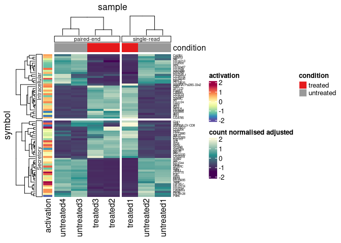<!-- -->

## Annotation size

We can customise annotation sizes using the `grid::unit()`, and the size
of their names using in-built `ComplexHeatmap` arguments

``` r
pasilla_plus |>
    heatmap(
        .column = sample,
        .row = symbol,
        .value = `count normalised adjusted`
    ) |>
    add_tile(condition, size = unit(0.3, "cm"), annotation_name_gp= gpar(fontsize = 8)) |>
    add_point(activation, size = unit(0.3, "cm"),   annotation_name_gp= gpar(fontsize = 8)) |>
    add_tile(act, size = unit(0.3, "cm"),   annotation_name_gp= gpar(fontsize = 8)) |>
    add_bar(size, size = unit(0.3, "cm"),   annotation_name_gp= gpar(fontsize = 8)) |>
    add_line(age, size = unit(0.3, "cm"),   annotation_name_gp= gpar(fontsize = 8))
```

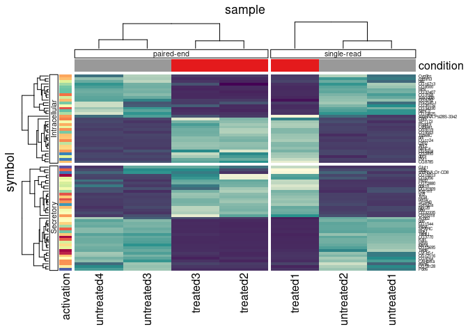<!-- -->

# Layer symbol

Add a layer on top of the heatmap

``` r
tidyHeatmap::pasilla |>
    
    # filter
    filter(symbol %in% head(unique(tidyHeatmap::pasilla$symbol), n = 10)) |>
    
    heatmap(
        .column = sample,
        .row = symbol,
        .value = `count normalised adjusted`
    ) |> 
    layer_point(
        `count normalised adjusted log` > 6 & sample == "untreated3" 
    )
```

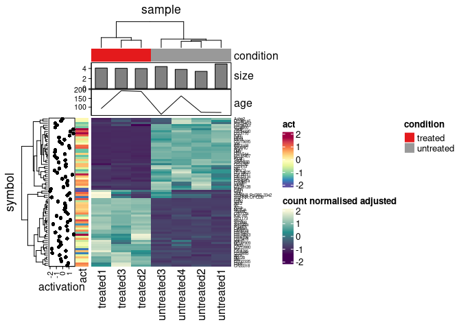<!-- -->

# ComplexHeatmap further styling

## Add cell borders

``` r
mtcars_tidy |> 
    heatmap(
        `Car name`, Property, Value, 
        rect_gp = grid::gpar(col = "#161616", lwd = 0.5)
    ) 
```

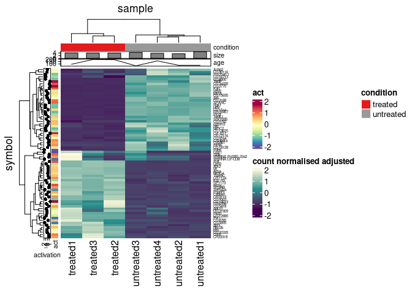<!-- -->

## Drop row clustering

``` r
mtcars_tidy |> 
    heatmap(
        `Car name`, Property, Value, 
        cluster_rows = FALSE
    ) 
```

<!-- -->

## Reorder rows elements

``` r
library(forcats)
mtcars_tidy |> 
    mutate(`Car name` = fct_reorder(`Car name`, `Car name`, .desc = TRUE)) %>% 
    heatmap(
        `Car name`, Property, Value, 
        cluster_rows = FALSE
    ) 
```

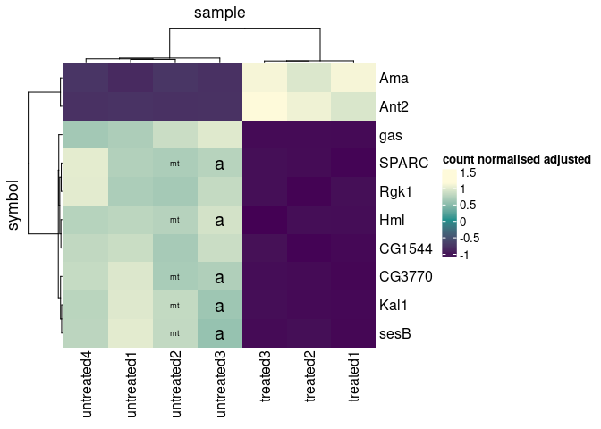<!-- -->

## Size of dendrograms

``` r
mtcars_tidy |> 
    mutate(`Car name` = fct_reorder(`Car name`, `Car name`, .desc = TRUE)) %>% 
    heatmap(
        `Car name`, Property, Value, 
        column_dend_height = unit(0.2, "cm"), 
        row_dend_width = unit(0.2, "cm")
    ) 
```

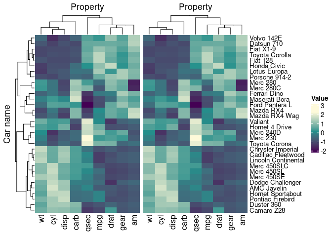<!-- -->

## Size of rows/columns titles and names

``` r
mtcars_tidy |> 
    mutate(`Car name` = fct_reorder(`Car name`, `Car name`, .desc = TRUE)) %>% 
    heatmap(
        `Car name`, Property, Value, 
        row_names_gp = gpar(fontsize = 7),
        column_names_gp = gpar(fontsize = 7),
        column_title_gp = gpar(fontsize = 7),
        row_title_gp = gpar(fontsize = 7)
    ) 
```

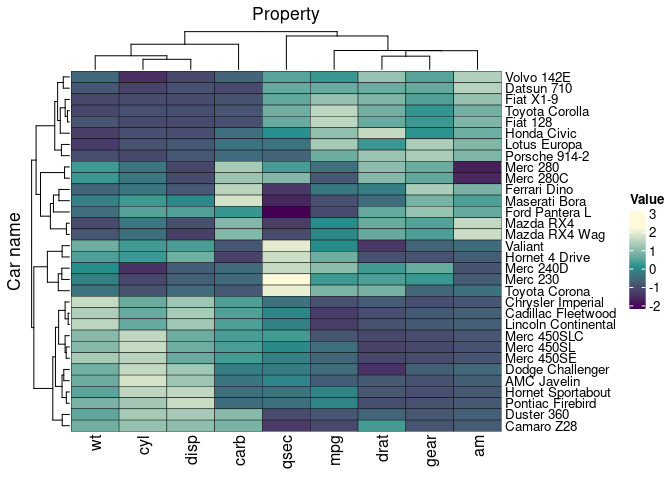<!-- -->
